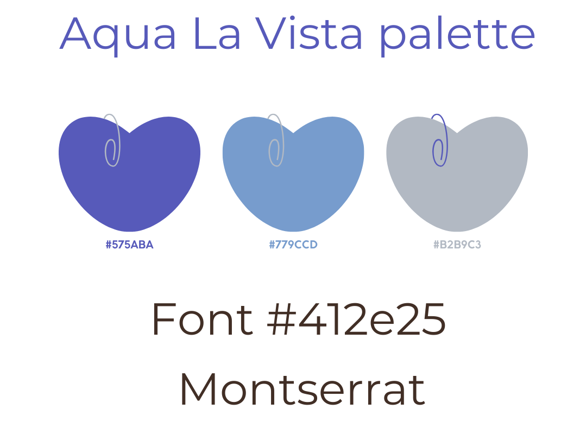
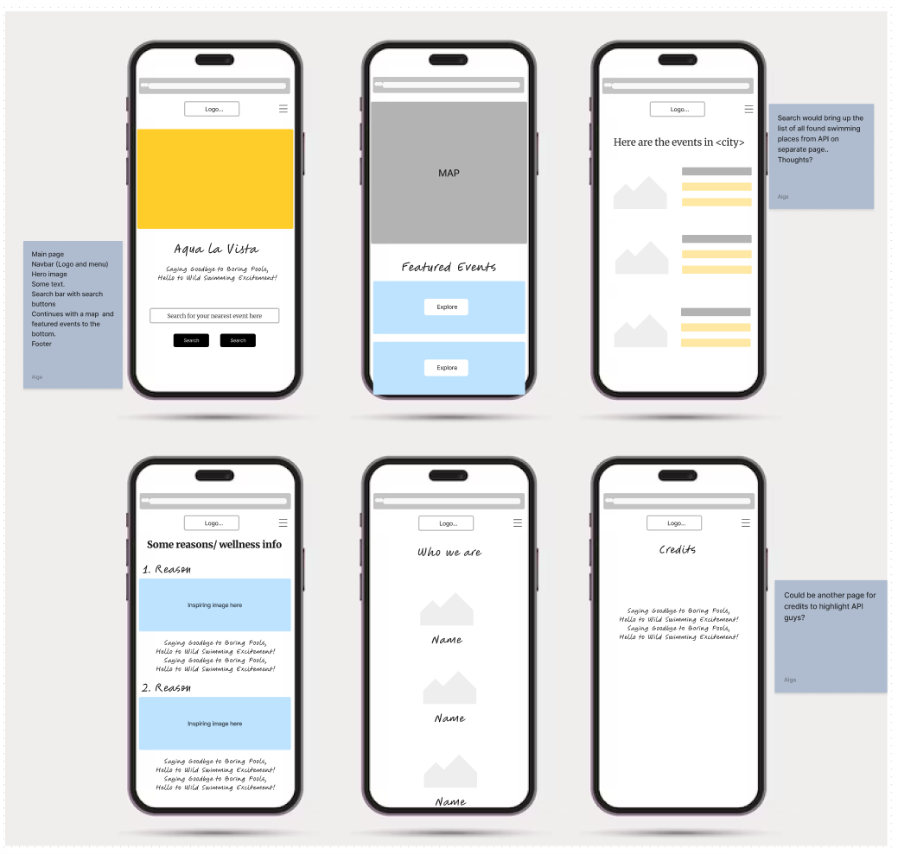
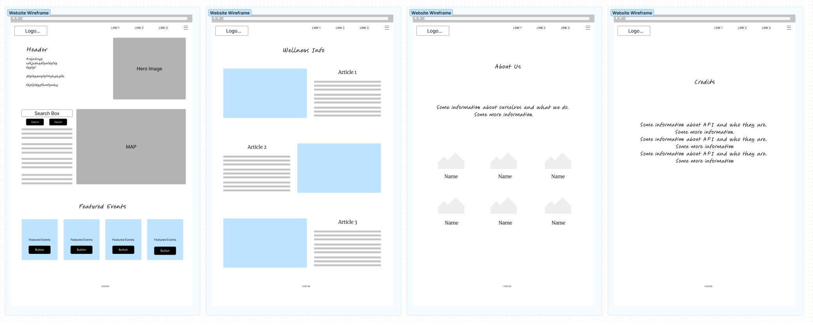

<h1 align="center"><strong>🌞🚵 Summer of Code 🏄🏖️</strong></h1>

# Aqua La Vista 
Aqua La Vista - Saying Goodby to Boring Pools, Hello to Wild Swimming Excitement - is a mobile app designed to encourage exercise, socialisation, and the alleviation of depression and anxiety through the enjoyment of nature with a focus on wild swimming. 

## Deployment

The project is deployed and can be accessed [HERE](https://ant2210.github.io/aqua-la-vista/).

1. [Criteria](#criteria)
2. [Introduction](#introduction)
3. [Goal](#goal)
   - [Design Choices](#design-choices)
   - [Colour](#colour)
   - [Wireframes](#wireframes)
4. [Technologies](#technologies)
5. [Features](#features)
   - [Home Page](#existing-features)
   - [About Page](#existing-features)
   - [Blog Page](#existing-features)
   - [Contact Page](#existing-features)
6. [Testing](#testing)
   - [Bugs](#bugs)
   - [Validator Testing](#validator-testing)
7. [Deployment](#deployment)
8. [Credits](#credits)

## Criteria
In this section, we will briefly discuss how our team addressed the applicable criteria:

- ✨ Project is 100% Mobile First
- ✨ Project uses browser location or device camera
- ✨ Project aligns well to the Hackathon Theme
- ✨ Clear use of Github Projects or other agile tool
- ✨ Presentation Quality - Present as if you are pitching it to client

# ABOUT AQUA LA VISTA
## Introduction
Aqua La Vista - Saying Goodby to Boring Pools, Hello to Wild Swimming Excitement - is a mobile app designed to encourage exercise, socialisation, and the alleviation of depression and anxiety through the enjoyment of nature with a focus on wild swimming. 

The website provides information about the benefits of wild swimming for health and wellness, along with an interactive map where visitors can search for wild swimming events around the United Kingdom and Ireland.

## Goal XXXXXX TO DO XXXXXXX
The goal section provides a concise summary of the main objective or purpose of the project or software described in this README. It addresses the following aspects:

- ➡️ Problem Statement
- ➡️ Objective(s)
- ➡️ Target Audience
- ➡️ Benefits

### Design Choices

In designing the website rather than go for the traditional blue (for ocean/water) we used primary colours which fall into the blue family including.

### Colours

Our design uses wthree main colours plus a text colour, with the main font being Monstserrat.

### Wireframes

Mobile wireframe outlining different pages

Wireframe of website

## Technologies
In the tech section, we provide information about the technology stack, dependencies, and any technical details related to the project.

➡️ Bootstrap

➡️ Canva

➡️ Codeanywhere

➡️ Figma

➡️ GitHub

➡️ Google Maps

➡️ React

➡️ SerpAPI

➡️ VSCode

## Features

## Testing

## Deployment

Each team member created their own individual branch divergent from the main branch and communicated via our team group on Slack to collaborate, pitch ideas, fix bugs and talk about relevant Pull Requests. Regular commits and pushes to Github have been employed to be able to track and trace the development process of this application. VSCode and CodeAnywhere were the main development tools used for this project.

The instructions below cover local deployment along with deployment to GitHub Pages:

### Local Deployment 

This repository can be cloned and run locally with the following steps:

- Login to GitHub.
- Select repository named: Ant2210/aqua-la-vista

- Click the code toggle button and copy the url, e.g. https://github.com/Ant2210/aqua-la-vista.git.

- Open a New Terminal n your IDE and run the git clone command - e.g. git clone https://github.com/Ant2210/aqua-la-vista.git. The repository will now be cloned in your workspace.

### Deployment to GitHub

The live version of this project is deployed via GitHub pages. The procedure for deployment follows the "Creating your site" steps provided in GitHub Docs.

- Log into Github.
- Select desired GitHub Repository to be deployed live.
- Underneath the repository name, click the “Settings” option.
- In the sub-section list on the left, under “Code and automation”, click “Pages”.
- Within the ”Source” section choose ”main” as Branch and root as folder and click ”Save”.
- The page refreshes and a website shall then deploy via a link.

The following is the live link deployed: https://ant2210.github.io/aqua-la-vista/.

## Credits
We would like to give credit to the following individuals, organizations, and resources that have contributed to the project or provided inspiration:

SerpAPI - For providing us with free api credits so that our map works - https://serpapi.com

Winnie Poaty @winniepoaty - https://www.instagram.com/winniepoaty/ - for giving consent/permission to use her wild swimming photos

## Acknowledgements

ChaptGPT was used in this project in the following way:

An Ode To Wild Swimming - this poem was written using ChatGPT

Initial research for potential topics was undertaken using ChatGPT but further research was done and information obtained from ChatGPT was edited and re-written.
