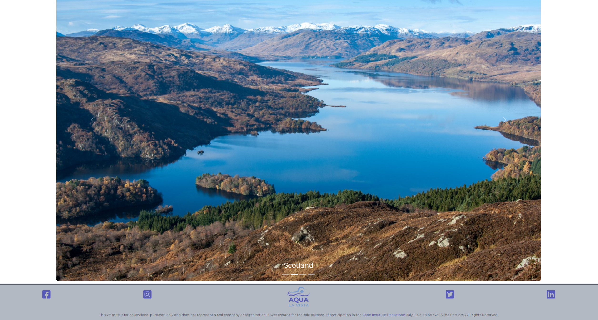

<h1 align="center"><strong>🌞🚵 Summer of Code 🏄🏖️</strong></h1>

# Aqua La Vista 
Aqua La Vista - Saying Goodby to Boring Pools, Hello to Wild Swimming Excitement - is a mobile app designed to encourage using the enjoyment of nature for exercise, socialisation, and the alleviation of depression and anxiety with a focus on wild swimming. 

## **DEPLOYMENT**

The project is deployed via Netlify and can be accessed [HERE](https://aqua-la-vista.netlify.app/).

1. [Criteria](#criteria)
2. [Introduction](#introduction)
3. [Goal](#goal)
   - [Design Choices](#design-choices)
   - [Colours](#colours)
   - [Wireframes](#wireframes)
4. [Technologies](#technologies)
5. [Features](#features)
   - [Home Page](#home-page)
   - [About](#about)
   - [Benefits](#benefits)
   - [Research](#research)
   - [Countries](#countries)
   - [Contact](#contact)
6. [Testing](#testing)
7. [Deployment](#deployment)
8. [Credits](#credits)

## **CRITERIA**
Our team ensured we adhered to the criteria for this project by ensuring:

- ✨ The app is 100% Mobile First
- ✨ The app uses browser location 
- ✨ Content covers the Hackathon theme of using nature to focus on exercise, socialisation and the alleviation of depression and anxiety
- ✨ We have demonstrated a clear use of Github Projects to distribute tasks
- ✨ Our presentation video includes a client pitch

# About Aqua La Vista
## **INTRODUCTION**
Aqua La Vista - Saying Goodby to Boring Pools, Hello to Wild Swimming Excitement - is a mobile app designed to encourage exercise, socialisation, and the alleviation of depression and anxiety through the enjoyment of nature with a focus on wild swimming. 

The website provides information about the benefits of wild swimming for health and wellness, along with a search area where visitors can search for wild swimming events in their local area and/or around the UK and Ireland.

## **GOAL** 
The goal of our app is to educate and provide a resource for information and events on wild swimming.

➡️ **Problem Statement**

Post pandemic, mental health issues are on the rise and more people are leading sedentary lifestyles resulting in various health issues such as depression, anxiety, and a lack of physical exercise. The British Journal of child health produced a report in April 2021 on the reduced physical activity and increased sedentary behaviour of young people since 2020.

Additionally, people may not be aware of the benefits on wild swimming as a way to enjoy nature, socialise with others, make new friends, and improve overall well-being.

➡️ **Objectives**

The objectives of the Aqua La Vista app is to:

- Raise awareness: Educate users about the benefits of wild swimming, including physical exercise, fostering friendships, embracing nature and the positive impact that wild swimming can have on mental health.

- Encourage participation: We want to motivate our users to engage in wild swimming activities by providing information about suitable locations, safety guidelines, and group activities.

- Foster community: By providing the ability to search for local events and by featuring events and people who are active in the wild swimming community the app will support the ability to connect with like-minded individuals. 

- Achieve Organic Growth: The app provides social links giving users an opportunity to share events and our articles on their social media page, which will help us with organic growth.

➡️ **Target Audience** 

The target audience for the app includes people interested in outdoor activities, nature enthusiasts, fitness enthusiasts, as well as those looking to get started in a nature-based activity. This could include individuals of various age groups, from teenagers to adults and families.

➡️ **Benefits**

- Education and awareness: The app will serve as a comprehensive platform to educate users about the benefits of wild swimming, sharing articles, events and personal testimonials.

- Location information: Using our search area users will be provided with detailed information about various wild swimming locations.

- Community building: In the future we hope to host a membership site and include social media integration to facilitate community engagement, allowing users to share their experiences, organise their own events, and connect with others who share a passion for wild swimming.

- Encouraging participation: By developing a mobile app and a website that focus on wild swimming, individuals can be inspired to embrace outdoor activities, connect with nature, build friendships with like-minded individuals, and find solace from depression and anxiety through the therapeutic benefits of wild swimming.

- Safety guidelines: The app provides safety guidelines including tips for beginners and advice on how to stay safe in different natural water environments through our Q&A section and articles.

### **Design Choices**

Our design focused on the search map as the main resource of the app using an API. Using the support of SERPAPI we were able to gain an additonal 400 search queries so the app can be tested to ensure it works.

In designing the website rather than go for the traditional blue (for ocean/water) we used primary colours which fall into the blue family including a strong purple, a lighter constrating blue and grey. These colours were selected to fit in with the hero image and other images on the app.

### **Colours**

Our design uses three main colours plus a text colour, with the main font being Monstserrat.

### **Wireframes**

Mobile wireframe outlining different pages

Wireframe of website

## **TECHNOLOGIES**
In the tech section, we provide information about the technology stack, dependencies, and any technical details related to the project.

➡️ Bootstrap

➡️ Canva

➡️ Codeanywhere

➡️ Email JS - to collect contact form information

➡️ Figma

➡️ GitHub

➡️ Netlify

➡️ Open Street Map

➡️ React

➡️ VSCode

➡️ ChatGPI API - Our system leverages the ChatGPT API to provide users with personalized recommendations for wild swimming destinations based on their location. Users have two options to receive recommendations: automatic detection of their browser location or manual entry of a specific town or city.

## **Contact**

## **FEATURES**

The Aqua La Vista application includes the following pages:

- Home
- About
- Benefits
- Research
- Countries
- Contact

## **Home Page**

Includes our logo on the left with navigation menu button on the right.

An introduction to the site using our tagline "Saying goodbye to boring pools, hello to wild swimming excitement!"

We have used ChatGPI API to include a search function. When a user chooses the automatic option, our system uses the browser's geolocation feature to retrieve their current latitude and longitude coordinates. This information is then passed to the ChatGPT API as input. The model processes the input and generates recommendations based on the user's location, taking into account factors such as nearby lakes, rivers, or coastal areas suitable for wild swimming. The recommendations are returned to the user, providing them with potential destinations to explore.

Alternatively, if a user prefers to enter a specific town or city, they can input their desired location manually. For example, they might type in "Dublin" or "Aberystwyth." The user's input is sent to the ChatGPT API, which interprets the location and generates recommendations specific to that area. The recommendations consider wild swimming spots near the specified town or city, such as nearby beaches, lakes, or reservoirs.

By using the ChatGPT API, our system combines the power of natural language processing with geolocation data to deliver personalised recommendations for destinations. Whether users opt for automatic location detection or manual entry, they receive suggestions tailored to their preferences and the availability of suitable locations near their town or city. This allows users to discover new and exciting places to enjoy wild swimming activities.

## **About**

The about page includes photos of our team with a brief introduction.

## **Benefits**

The benefits page includes information on the benefits of wild swimming with images.

## **Research**

This page highlights important research on the importance of wild swimming for exercise, socialisation and the alleviation of depression and anxiety.

## **Countries**

Access to our ChatGPI AI search function is followed by scrolling images which link to wild swimming locations in England, Ireland, Wales and Scotland. This is also available in the top navigation.

## **Contact**

The contact page includes a contact form for anyone who wants to get in touch.

### **Future Features**

Members area: The app will be updated to include an area for users to register and share their own wild swimming photos, as well as connect with other users. It will also provide information about water conditions, weather updates, emergency contacts, and safety precautions to ensure a safe wild swimming experience. 

## **TESTING**

The site was run through Google Lighthouse and scored well for accessibility. It included a warning ***"Error with Permissions-Policy header: Unrecognized feature: 'interest-cohort'"*** - according to information provided by Stack Overflow this is an issue with GitHub hosted pages which disable Google's third party cookie called FLoC.

The W3C CSS Validator found no issues with the css code

## **DEPLOYMENT**

Each team member created their own individual branch divergent from the main branch and communicated via our team group on Slack to collaborate, pitch ideas, fix bugs and talk about relevant Pull Requests. Regular commits and pushes to Github have been employed to be able to track and trace the development process of this application. VSCode and CodeAnywhere were the main development tools used for this project.

The instructions below cover local deployment along with deployment to GitHub Pages:

### **Local Deployment** 

This repository can be cloned and run locally with the following steps:

- Login to GitHub.
- Select repository named: Ant2210/aqua-la-vista

- Click the code toggle button and copy the url, e.g. https://github.com/Ant2210/aqua-la-vista.git.

- Open a New Terminal in your IDE and run the git clone command - e.g. git clone https://github.com/Ant2210/aqua-la-vista.git. The repository will now be cloned in your workspace.

### **Deployment**

The live version of this project is deployed via Netlify.

The initial deployment of the website was conducted on GitHub Pages; however, due to limitations within the platform, the handling of secret API keys became problematic. Despite the utilization of GitHub secrets to store the API key for openAI, it was inadvertently exposed on the frontend when API calls were made. Consequently, this led to a recurring revocation of the API key. In order to swiftly address this concern, the decision was made to migrate the website to Netlify. This transition allowed for the implementation of a serverless function, thereby resolving the issue and ensuring the secure invocation of the API.

## **CREDITS**
We would like to give credit to the following individuals and resources that have contributed to the project:

Winnie Poaty @winniepoaty - https://www.instagram.com/winniepoaty/ - for giving consent/permission to use her wild swimming photos

ChaptGPT was used in this project in the following way:

Initial research for potential topics was undertaken using ChatGPT but further research was done and information obtained from ChatGPT was edited and re-written.
API function was used to power our geolocation search function.

Stack Overflow for finding answers to a potential issue.
